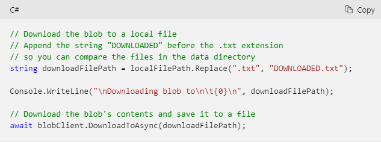
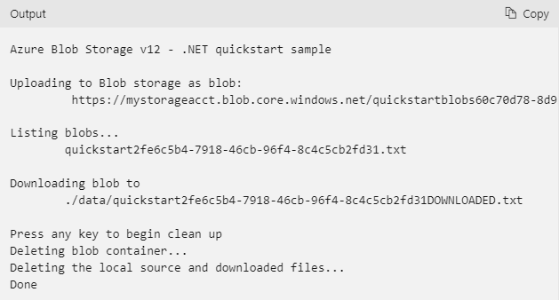

# Azure Blobs

Blob storage is optimized for storing massive amounts of unstructured data.

### Blob storage is designed for

Serving images or documents directly to a browser.

Storing files for distributed access.

Streaming video and audio.

Writing to log files.

Storing data for backup and restore, disaster recovery, and archiving.

Storing data for analysis by an on-premises or Azure-hosted service.

### Blob storage resources

Blob storage offers three types of resources

The storage account

A container in the storage account

A blob in a container


### Storage accounts

A storage account provides a unique namespace in Azure for your data. Every object that you store in Azure Storage has an address that includes your unique account name. 

if your storage account is named mystorageaccount, then the default endpoint for Blob storage is

```
http://mystorageaccount.blob.core.windows.net
```

### Containers

A container organizes a set of blobs, similar to a directory in a file system. A storage account can include an unlimited number of containers, and a container can store an unlimited number of blobs.

### Blobs

Azure Storage supports three types of blobs:

Block blobs store text and binary data. Block blobs are made up of blocks of data that can be managed individually. Block blobs can store up to about 190.7 TiB.

Append blobs are made up of blocks like block blobs, but are optimized for append operations. Append blobs are ideal for scenarios such as logging data from virtual machines.

Page blobs store random access files up to 8 TiB in size. Page blobs store virtual hard drive (VHD) files and serve as disks for Azure virtual machines. For more information about page blobs


### Move data to Blob storage

A number of solutions exist for migrating existing data to Blob storage

AzCopy is an easy-to-use command-line tool for Windows and Linux that copies data to and from Blob storage, across containers, or across storage accounts. For more information about AzCopy.

The Azure Storage Data Movement library is a .NET library for moving data between Azure Storage services. The AzCopy utility is built with the Data Movement library.

Azure Data Factory supports copying data to and from Blob storage by using the account key, a shared access signature, a service principal, or managed identities for Azure resources.

Blobfuse is a virtual file system driver for Azure Blob storage. You can use blobfuse to access your existing block blob data in your Storage account through the Linux file system. 

Azure Data Box service is available to transfer on-premises data to Blob storage when large datasets or network constraints make uploading data over the wire unrealistic. Depending on your data size, you can request Azure Data Box Disk, Azure Data Box, or Azure Data Box Heavy devices from Microsoft. You can then copy your data to those devices and ship them back to Microsoft to be uploaded into Blob storage.

The Azure Import/Export service provides a way to import or export large amounts of data to and from your storage account using hard drives that you provide. 

### Create the project

```
1- dotnet new console -n BlobQuickstartV12

2- cd BlobQuickstartV12

3- mkdir data // where the blob data files will be created and stored.

4- dotnet add package Azure.Storage.Blobs // Install the package
```

### Set up the app framework
From the project directory

Open the Program.cs file in your editor.

Remove the Console.WriteLine("Hello World!"); statement.

Add using directives.

Update the Main method declaration to support async.

### Get the connection string

```
string connectionString = Environment.GetEnvironmentVariable("AZURE_STORAGE_CONNECTION_STRING");
```

### Create a container

```
// Create a BlobServiceClient object which will be used to create a container client
BlobServiceClient blobServiceClient = new BlobServiceClient(connectionString);

//Create a unique name for the container
string containerName = "quickstartblobs" + Guid.NewGuid().ToString();

// Create the container and return a container client object
BlobContainerClient containerClient = await blobServiceClient.CreateBlobContainerAsync(containerName);
```

### Upload a blob to a container

```
string localPath = "./data/";
string fileName = "quickstart" + Guid.NewGuid().ToString() + ".txt";
string localFilePath = Path.Combine(localPath, fileName);

await File.WriteAllTextAsync(localFilePath, "Hello, World!");

BlobClient blobClient = containerClient.GetBlobClient(fileName);

Console.WriteLine("Uploading to Blob storage as blob:\n\t {0}\n", blobClient.Uri);

await blobClient.UploadAsync(localFilePath, true);
```

### List blobs in a container

List the blobs in the container by calling the GetBlobsAsync method. 

```
Console.WriteLine("Listing blobs...");

// List all blobs in the container
await foreach (BlobItem blobItem in containerClient.GetBlobsAsync())
{
    Console.WriteLine("\t" + blobItem.Name);
}
```

### Download a blob

Download the previously created blob by calling the DownloadToAsync method.



### Delete a container

The following code cleans up the resources the app created by deleting the entire container by using DeleteAsync. It also deletes the local files created by the app.

```
// Clean up
Console.Write("Press any key to begin clean up");
Console.ReadLine();

Console.WriteLine("Deleting blob container...");
await containerClient.DeleteAsync();

Console.WriteLine("Deleting the local source and downloaded files...");
File.Delete(localFilePath);
File.Delete(downloadFilePath);

Console.WriteLine("Done");
```

### Run the code

```
dotnet build
dotnet run
```

output will be like


