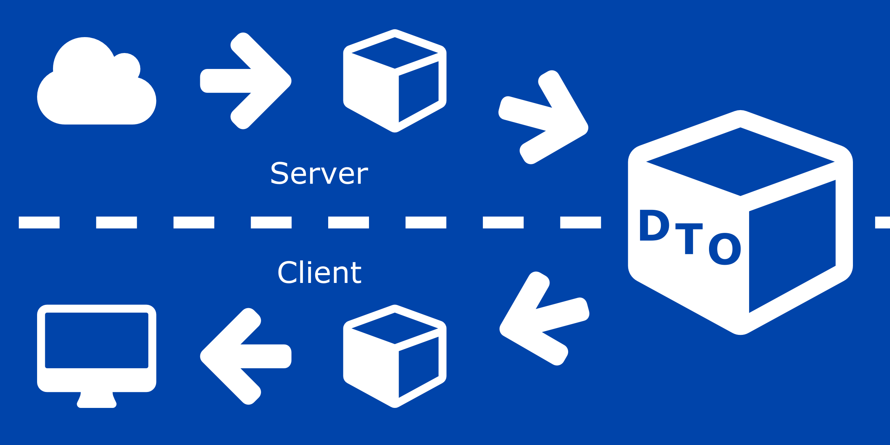

# Data Transfer Objects: is an object that defines how the data will be sent over the network.



The biggest advantage of using DTOs is decoupling clients from your internal data structures,transport data from one layer of an application to another layer.

### Why use Data Transfer Objects (DTOs)?

1- A DTO is a great choice when you would like to pass a lightweight object across the wire — especially when you’re passing your object via a medium that is bandwidth-constrained.

2- to abstract the domain objects of your application from the user interface or the presentation layer.

3- you can return only the data requested

4- Separate the service layer from the database layer

5- Hide specific properties that clients don’t need to receive

6- Omit properties to reduce the payload size

7- Manipulate nested objects to make them more convenient for clients

8- Avoid “overpost” vulnerabilities

9- Serialization & lazy load problems


### There are several ways in which you can implement immutable DTOs in C#

1- You could use a ReadOnlyCollection or the thread-safe immutable collection types present in the System.Collections.Immutable namespace. 

2- You can take advantage of record types in C# 9 to implement immutable DTOs as well.

### DTO conventions & validation

ASP.NET Boilerplate strongly supports DTOs. It provides conventional classes, interfaces, and standardizes DTO naming and usage conventions. When you write your code as described here in the documentation, ASP.NET Boilerplate will easily automate some common tasks.

resource : https://aspnetboilerplate.com/Pages/Documents/Data-Transfer-Objects

below is an Entity class or a business class. it has business logic in the setters.

```
class CustomerBO
{
        private string _CustomerName;
        public string CustomerName
        {
            get { return _CustomerName; }
            set 
            {
                if (value.Length == 0)
                {
                    throw new Exception("Customer name is required");
                }
                _CustomerName = value; 
            }
        }
}

```

A data transfer object of the above Customer entity class would look something as shown below. It will only have setters and getters that means only data and no business logic.

```
class CustomerDTO
{
        public string CustomerName { get; set; }
}
```

resource: https://www.codeproject.com/Articles/1050468/Data-Transfer-Object-Design-Pattern-in-Csharp


