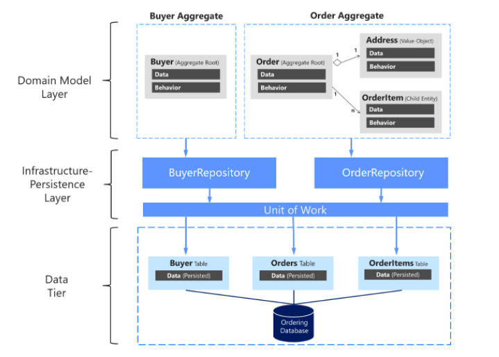

# Dependency injection in ASP.NET Core

A dependency is an object that another object depends on

### The Repository pattern

Repositories are classes or components that encapsulate the logic required to access data sources. They centralize common data access functionality, providing better maintainability and decoupling the infrastructure or technology used to access databases from the domain model layer. 

### Define one repository per aggregate

The above diagram shows the relationships between Domain and Infrastructure layers: Buyer Aggregate depends on the IBuyerRepository and Order Aggregate depends on the IOrderRepository interfaces, these interfaces are implemented in the Infrastructure layer by the corresponding repositories that depend on UnitOfWork, also implemented there, that accesses the tables in the Data tier.

### Repository Design Pattern

have two purposes; first it is an abstraction of the data layer and second it is a way of centralising the handling of the domain objects.

### SOLID  principles

The reason behind most successful applications

1- Choosing the correct architecture (in other words MVC, 3-tier, Layered, MVP, MVVP and so on).

2- Following Design Principles.

3- Choosing correct Design Patterns to build the software based on its specifications.

basic design principles. SOLID stands for 

Single Responsibility Principle (SRP) every class, or similar structure, in your code should have only one job to do

Open closed Principle (OSP) we need to design our module/class in such a way that the new functionality can be added only when new requirements are generated

Liskov substitution Principle (LSP) you should be able to use any derived class instead of a parent class and have it behave in the same manner without modification

Interface Segregation Principle (ISP) that clients should not be forced to implement interfaces they don't use. Instead of one fat interface, many small interfaces are preferred based on groups of methods, each one serving one submodule

Dependency Inversion Principle (DIP)   high-level modules/classes should not depend on low-level modules/classes. Both should depend upon abstractions. Secondly, abstractions should not depend upon details. Details should depend upon abstractions.

resource: https://www.c-sharpcorner.com/UploadFile/damubetha/solid-principles-in-C-Sharp/

