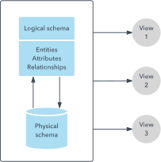

# ERDs

### DataType: attribute is used to specify a data type that's more specific than the database intrinsic type.

### StringLength: attribute sets the maximum length in the database and provides client side and server side validation for ASP.NET Core MVC. 

### Column attribute: control how your classes and properties are mapped to the database. 

### Required attribute makes the name properties required fields.

### The CourseAssignments and OfficeAssignment properties are navigation properties.

### DatabaseGenerated : specifies that primary key values are provided by the user rather than generated by the database.

# DBMS

### Database is a collection of related data

### Database Management System: stores data in such a way that it becomes easier to retrieve, manipulate, and produce information.

### DBMS has the following characteristics:

* Relation-based tables

* Less redundancy

* Query Language

* Consistency

### Users

### Administrators − Administrators maintain the DBMS and are responsible for administrating the database.

### Designers − Designers are the group of people who actually work on the designing part of the database.

### End Users − End users are those who actually reap the benefits of having a DBMS.

* What is a Schema?

database schema is an abstract design that represents the storage of your data in a database. It describes both the organization of data and the relationships between tables in a given database.

* Why do we use them?

use database schema to help programmers whose software will interact with the database.

* What do they look like?

What is a Primary Key?
A primary key is a special relational database table column (or combination of columns) designated to uniquely identify each table record.

What is a Foreign Key?
is a column or group of columns in a relational database table that provides a link between data in two tables.

What is a Composite Key?
is a combination of two or more columns in a table that can be used to uniquely identify each row in the table.

What is a 1:1 relationship?
It’s a relationship where a record in one entity (table) is associated with exactly one record in another entity (table).

What is a Many:Many relationship?
 is where more than one record in a table is related to more than one record in another table.

 1: Many
occurs when a parent record in one table can potentially reference several child records in another table

