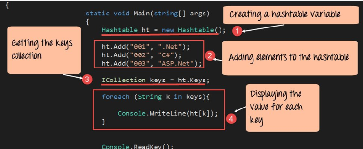

# Hashtable 



### Hash - A hash is the result of some algorithm taking an incoming string and converting it into a value that could be used for either security or some other purpose. In the case of a hashtable, it is used to determine the index of the array.

### Buckets - A bucket is what is contained in each index of the array of the hashtable. Each index is a bucket. An index could potentially contain multiple key/value pairs if a collision occurs.

### Collisions - A collision is what happens when more than one key gets hashed to the same location of the hashtable.

every Node or Bucket has both a key, and a value.

hash code turns a key into an integer. It’s very important that hash codes are deterministic: their output is determined only by their input. Hash codes should never have randomness to them. The same key should always produce the same hash code.

### Creating a Hash: A hashtable  is created from an array

1- Add or multiply all the ASCII values together.

2- Multiply it by a prime number such as 599.

3- Use modulo to get the remainder of the result, when divided by the total size of the array.

4- Insert into the array at that index.

Example
```
Key = "Cat"
Value = "Josie"

67 + 97 + 116 = 280

280 * 599 = 69648

69648 % 1024 = 16

Key gets placed in index of 16. 
```

### Collisions

If two keys ever ultimately resolved to the same index, then two calls to .Add(key, val) with different keys would overwrite each other.

Each index in the array is called a “bucket” because it can store multiple key/value pairs.

### Hash maps do this to store values

accept a key

calculate the hash of the key

use modulus to convert the hash into an array index

store the key with the value by appending both to the end of a linked list

### Hash maps do this to read value

accept a key

calculate the hash of the key

use modulus to convert the hash into an array index

use the array index to access the short LinkedList representing a bucket

search through the bucket looking for a node with a key/value pair that matches the key you were given

### Bucket Sizes

Hash Maps can have any number of buckets. If a hash map has only a few buckets it will be densely full and have many collisions. If a hash map has more buckets it will be more sparsely populated, there will be less collisions, but there may be a lot of extra empty space.

```
Bucket 0: [{Renton: 98055} --> {Capital Hill: 98102} --> {Greenwood: 98103} --> {Greenlake: 98103} --> {Pioneer Square: 98104} --> {University District: 98105} --> {Columbia City: 98118}]
Bucket 1: [{Bellevue: 98005} --> {Seattle: 98101}]
Bucket 2: [{Mercer Island: 98040} --> {Alki Beach: 98116} --> {Northgate: 98125}]
Bucket 3: [{Downtown: 98101} --> {Laurelhurst: 98105} --> {Bainbridge Island: 98110} --> {Magnolia: 98199}]
Bucket 4: [{Kirkland: 98033} --> {Lynnwood: 98037} --> {Ballard: 98107} --> {Queen Anne: 98109} --> {West Seattle: 98116}]
Bucket 5: [{International District: 98104} --> {Mount Baker:98144}]
Bucket 6: [{Redmond: 98052} --> {Freemont: 98103} --> {South Lake Union: 98109} --> {Madrona: 98110} --> {Belltown: 98121}]
```

### Internal Methods

#### Add()

When adding a new key/value pair to a hashtable

send the key to the GetHash method.

Once you determine the index of where it should be placed, go to that index

Check if something exists at that index already, if it doesn’t, add it with the key/value pair.

If something does exist, add the new key/value pair to the data structure within that bucket.

#### Find()

The Find takes in a key, gets the Hash, and goes to the index location specified. Once at the index location is found in the array, it is then the responsibility of the algorithm the iterate through the bucket and see if the key exists and return the value.

#### Contains()

The Contains method will accept a key, and return a bool on if that key exists inside the hashtable. The best way to do this is to have the contains call the GetHash and check the hashtable if the key exists in the table given the index returned.

#### GetHash()

The GetHash will accept a key as a string, conduct the hash, and then return the index of the array where the key/value should be placed.
