# ASP.NET Core Identity:

1- Is an API that supports user interface (UI) login functionality.

2- Manages users, passwords, profile data, roles, claims, tokens, email confirmation, and more.

Identity is typically configured using a SQL Server database to store user names, passwords, and profile data. Alternatively, another persistent store can be used, for example, Azure Table Storage

### Microsoft identity platform is:

1- An evolution of the Azure Active Directory (Azure AD) developer platform.

2- Unrelated to ASP.NET Core Identity.

ASP.NET Core Identity adds user interface (UI) login functionality to ASP.NET Core web apps. To secure web APIs and SPAs, use IdentityServer4.

### IdentityServer4 enables the following security features:

* Authentication as a Service (AaaS)

* Single sign-on/off (SSO) over multiple application types

* Access control for APIs

* Federation Gateway

### ASP.NET Core 2.0 Authentication and Authorization System Demystified

#### Identity

Key to understanding how authentication works is to first understand what an identity is in ASP.NET Core 2.0. There are three classes which represent the identity of a user: Claim, ClaimsIdentity, and ClaimsPrincipal

#### Claims

A Claim represents a single fact about the user. It could be the user's first name, last name, age, employer, birth date, or anything else that is true about the user. A single claim will contain only a single piece of information. A claim representing something about a user John Smith could be his first name: John. A second claim would be his last name: Smith.

#### ClaimsIdentity

An Identity represents a form of identification or, in other words, a single way of proving who you are. In real life this could be a driver's license. In ASP.Net Core, it is a ClaimsIdentity. This class represents a single form of digital identification.

#### ClaimsPrincipal

A Principal represents the actual user. It can contain one or more instances of ClaimsIdentity, just like in life a person may have a driver's license, concealed-carry permit, social security card, and a passport.

#### Verbs

There are 5 verbs (these can also be thought of as commands or behaviors) that are invoked by the auth system,

1- Authenticate
Gets the user’s information if any exists (e.g. decoding the user’s cookie, if one exists)

2- Challenge
Requests authentication by the user (e.g. showing a login page)

3- SignIn
Persists the user’s information somewhere (e.g. writes a cookies)

4- SignOut
Removes the user’s persisted information (e.g. deletes the cookies)

5- Forbid
Denies access to a resource for unauthenticated users or authenticated but unauthorized users (e.g. displaying a “not authorized” page)

#### Authentication Handlers

Authentication handlers are components that actually implement the behavior of the 5 verbs.Authentication handlers must be registered with the auth system in order to be used and are associated with schemes.

#### Authentication Middleware

A middleware is a module that can be inserted into the startup sequence and is run on every request.

#### Authentication and Authorization Flow

1- The request arrives at the server.

2- The authentication middleware calls the default handler's Authenticate method and populates the HttpContext.User object with any available information.

3- The request arrives at the controller action.

4- If the action is not decorated with the [Authorize] attribute, display the page and stop here.

5- If the action is decorated with [Authorize], the auth filter checks if the user was authenticated.

6- If the user was not, the auth filter calls Challenge, redirecting to the appropriate signin authority.

7- Once the signin authority directs the user back to the app, the auth filter checks if the user is authorized to view the page.

8- If the user is authorized, it displays the page, otherwise it calls Forbid, which displays a 'not authorized' page.