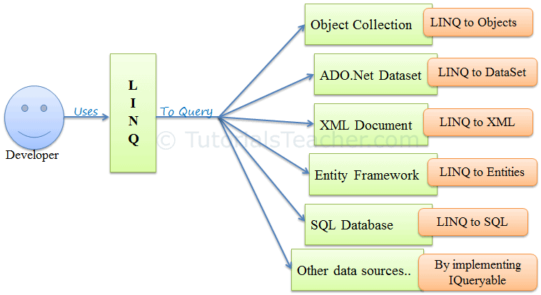
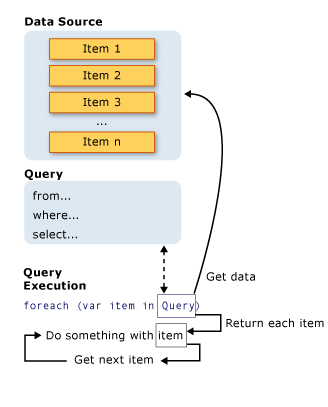

### Language Integrated Query (LINQ)
retrieve data from different sources and formats.



### LINQ queries return results as objects.

execute used foreach

A query is an expression that retrieves data from a data source.

#### All LINQ query operations consist of three distinct actions:

1- Obtain the data source.

2- Create the query.

3- Execute the query.



```
using System;
using System.Collections.Generic;
using System.Linq;

namespace linq
{
    public class Student
    {
        static void Main(string[] args)
        {
            // Create a data source by using a collection initializer.
            List<Student> students = new List<Student>
                {
                    new Student {First="Svetlana", Last="Omelchenko", ID=111, Scores= new List<int> {97, 92, 81, 60}},
                    new Student {First="Claire", Last="O'Donnell", ID=112, Scores= new List<int> {75, 84, 91, 39}},
                    new Student {First="Sven", Last="Mortensen", ID=113, Scores= new List<int> {88, 94, 65, 91}},
                    new Student {First="Cesar", Last="Garcia", ID=114, Scores= new List<int> {97, 89, 85, 82}},
            };
            // Create the query.
            // The first line could also be written as "var studentQuery ="
            var studentQuery =
                from student in students
                where student.Scores[0] > 90
                // To add another filter condition ==>  where student.Scores[0] > 90 && student.Scores[3] < 80
                
                // To order the results ==> orderby student.Last ascending
                
                // groups the students by using the first letter of their last name as the key.
                // ==> group student by student.Last[0];

                select student;
            // Execute the query.
            // var could be used here also.
            foreach (Student student in studentQuery)
            {
                Console.WriteLine("{0}, {1}", student.Last, student.First);

            }

        }
        public string First { get; set; } // auto-implemented properties.
        public string Last { get; set; }
        public int ID { get; set; }
        public List<int> Scores; 
}
}
        
```

### Need of LINQ

* LINQ is simpler

* ordered higher-level than SQL.

* LINQ is a more productive query language than SQL.

* LINQ has full type checking at compile time so that we can catch any error in compile time itself. 

### Disadvantages of LINQ are:

1- With the use of LINQ, it's very difficult to write a complex query like SQL.

2- It was written in the code, and we cannot make use of the Cache Execution plan, which is the SQL feature as we do in the stored procedure.

3- If the query is not written correctly, then the performance will be degraded.
