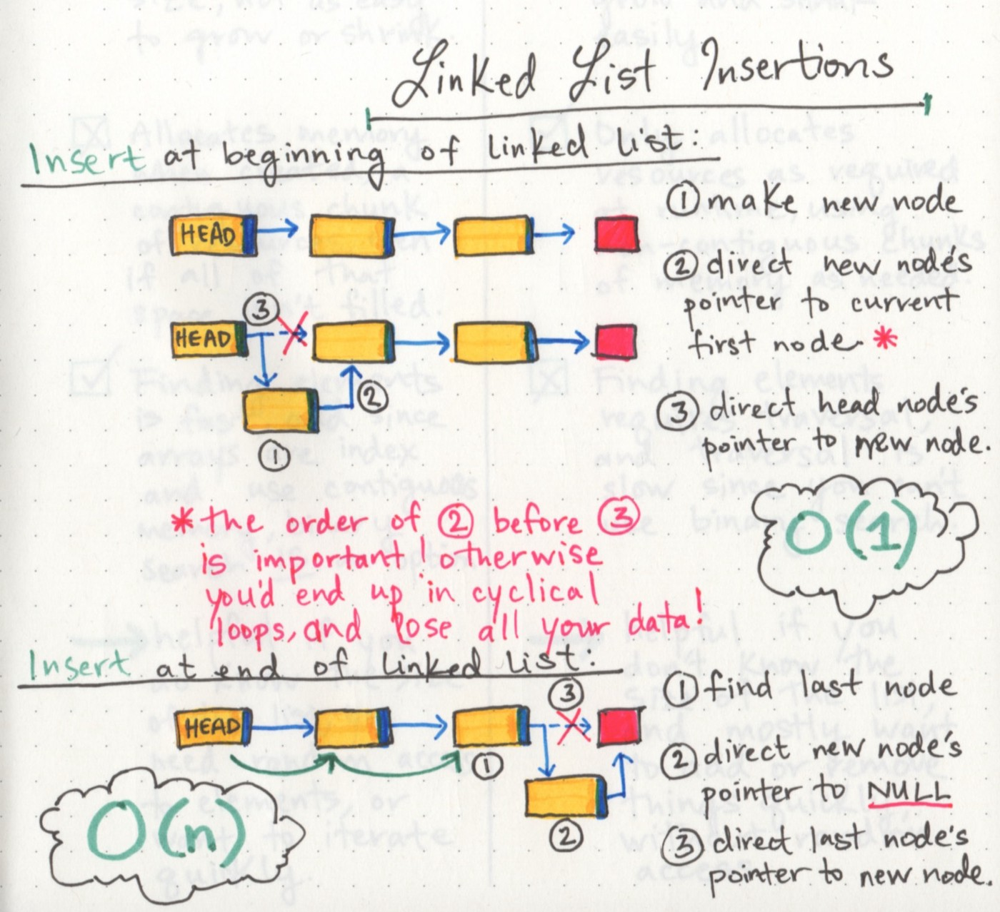

# Linked List

### Big O: Analysis of Algorithm Efficiency

### Big O(oh) notation is used to describe the efficiency of an algorithm or function, based on two factors

1- Running Time: The amount of time a function needs to complete.

2- Memory Space: The amount of memory resources a function uses to store data and instructions.

###  4 Key Areas for analysis

1- Input Size: refers to the size of the parameter values that are read by the algorithm, takes into account the size of each parameter value as well.

2- Units of Measurement: To evaluate a function for Time and Space complexity

3- Orders of Growth: As the value of input size grows, the Order of Growth represents the increase in Running Time or Memory Space.

O(1) constant efficiency: no matter what inputs are thrown at our algorithm, it always uses the same amount of time or space.

O(log n) Logarithmic Complexity: represents a function that sees a decrease in the rate of complexity growth, the greater our value of n.used among sorted data. As input size grows we can eliminate more values in the input. We are chopping our input in half

### Linked Lists: a linear data structure, sequence of Nodes that are connected/linked to each other. on the other hand non-linear data structures, items don’t have to be arranged in order, we traverse the data structure non-sequentially.

### Lists Types

* Singly: only go in one direction, node has only one reference, reference points to the next. start at the head node, and traverse from the root until the last node

* Doubly: node has a reference to both the Next and Previous node.

* Circular: it has a node that acts as the tail of the list, 
and the node after the tail node is the beginning of the list.

Node: individual items/links that live in a linked list. 

Next: reference to the next node.

Head: entry point, first node in a linked list.

Current: node that is currently being looked at.

Traversal: while() loop, to check next node

if we end up trying to traverse on a node that is null, a NullReferenceException gets thrown and our program. ex : Trees,graphs,hashes(dictionaries)

Traversal Big O: O(n)

Adding a Node: O(1)

Memory management

