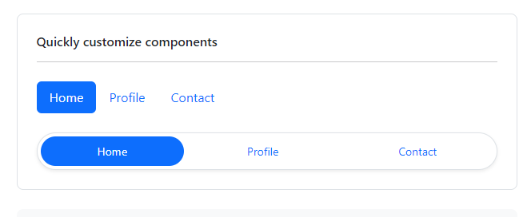
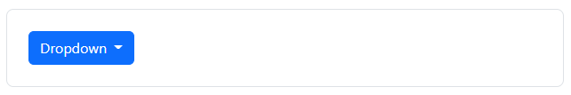

# Azure DevOps

provides developer services for allowing teams to plan work, collaborate on code development, and build and deploy applications. Azure DevOps supports a collaborative culture and set of processes that bring together developers, project managers, and contributors to develop software.

You can use one or more of the following standalone services based on your business needs:

Azure Repos provides Git repositories or Team Foundation Version Control (TFVC) for source control of your code. For more information about Azure Repos, see What is Azure Repos?.

Azure Pipelines provides build and release services to support continuous integration and delivery of your applications. For more information about Azure Pipelines, see What is Azure Pipelines?.

Azure Boards delivers a suite of Agile tools to support planning and tracking work, code defects, and issues using Kanban and Scrum methods. For more information about Azure Boards, see What is Azure Boards?.

Azure Test Plans provides several tools to test your apps, including manual/exploratory testing and continuous testing. For more information about Azure Test Plans, see Overview of Azure Test Plans

Azure Artifacts allows teams to share packages such as Maven, npm, NuGet, and more from public and private sources and integrate package sharing into your pipelines. For more information about Azure Artifacts, see Overview of Azure Artifacts.

#### Compare Azure DevOps Services with Azure DevOps Server

The cloud offering, Azure DevOps Services, provides a scalable, reliable, and globally available hosted service. It's backed by a 99.9% SLA, monitored by our 24/7 operations team, and available in local data centers around the world.

The on-premises offering, Azure DevOps Server, is built on a SQL Server back end. Customers usually choose the on-premises version when they need their data to stay within their network. Or, when they want access to SQL Server reporting services that integrate with Azure DevOps Server data and tools.


#### Choose Azure DevOps Services

Choose Azure DevOps Services when you want the following outcomes:

Quick set-up

Maintenance-free operations

Easy collaboration across domains

Elastic scale

Rock-solid security

### Connect to a project in Azure DevOps

Connect from the web portal

1- If you're not a member of a security group, ask your Project Administrator to add you.

2- Open a browser and enter a URL that uses the following form:

```
https://dev.azure.com/OrganizationName/ProjectName 
```

3- When you access the server for the first time, a Windows Identity dialog box appears. Enter your credentials and choose OK.

4- Choose your project, team, or page of interest.

From the project summary page, hover over a service and then choose the page you want. To choose another project, choose Azure DevOps.

What other clients support connection to Azure DevOps?
Besides connecting through a web browser, Visual Studio, Eclipse, Excel, and Project you can connect to a project from these clients:

1- Visual Studio Code

2- Visual Studio Community

3- Eclipse: Team Explorer Everywhere

4- Azure Test Plans (formerly Test Manager)

5- Microsoft Feedback Client

### Use personal access tokens

You can use a personal access token (PAT) as an alternate password to authenticate into Azure DevOps. In this article, we show you how to create, use, modify, and revoke PATs for Azure DevOps.

### PATs

A personal access token contains your security credentials for Azure DevOps. A PAT identifies you, your accessible organizations, and scopes of access. As such, they're as critical as passwords, so you should treat them the same way.

# MVC Architecture


### MVC is a design pattern or architecture which helps in developing the web application in a most efficient way when compared with the traditional ASP.NET Web Application.

### MVC makes the design of the application into three layers

#### Model layer represent the objects in our Application. Model is also a class which has all the objects and its properties and methods defined in it.

#### View Layer has all the html controls which define the UI of the application. Here in MVC, we don’t have drag and drop option for controls as we don’t use server controls. Instead we use Razor Engine available with Visual Studio by default which helps in rendering the View. Views are files with .cshtml extensions. .cshtml contain both html and server code. And also, using ‘@’, we can access C# code so that in our page which can access server side dynamic data.

#### Controller basically handles the request from user. It is the heart of the MVC application as everyone say. It is responsible to handle the request and return a response to user by loading appropriate View with data from Model. Controller is nothing but a class with a group of methods called actions. And Every action method returns view. A View can be anything like it can be xml or html or JSON etc. Controller maps the incoming user requests to appropriate Controller actions with the help of process called Routing.

# Tag Helpers

enable server-side code to participate in creating and rendering HTML elements in Razor files.

# What Tag Helpers provide

A way to make you more productive and able to produce more robust, reliable, and maintainable code using information only available on the server


# Managing Tag Helper scope

Tag Helpers scope is controlled by a combination of @addTagHelper, @removeTagHelper, and the "!" opt-out character.

@addTagHelper makes Tag Helpers available

If your project contains an EmailTagHelper with the default namespace (AuthoringTagHelpers.TagHelpers.EmailTagHelper), you can provide the fully qualified name (FQN) of the Tag Helper:

```
@using AuthoringTagHelpers
@addTagHelper *, Microsoft.AspNetCore.Mvc.TagHelpers
@addTagHelper AuthoringTagHelpers.TagHelpers.EmailTagHelper, AuthoringTagHe
```

@removeTagHelper removes Tag Helpers

The @removeTagHelper has the same two parameters as @addTagHelper, and it removes a Tag Helper that was previously added. For example, @removeTagHelper applied to a specific view removes the specified Tag Helper from the view. Using @removeTagHelper in a Views/Folder/_ViewImports.cshtml file removes the specified Tag Helper from all of the views in Folder.

#### Controlling Tag Helper scope with the _ViewImports.cshtml file

You can add a _ViewImports.cshtml to any view folder, and the view engine applies the directives from both that file and the Views/_ViewImports.cshtml file. If you added an empty Views/Home/_ViewImports.cshtml file for the Home views, there would be no change because the _ViewImports.cshtml file is additive.

#### Opting out of individual elements

You can disable a Tag Helper at the element level with the Tag Helper opt-out character ("!"). 

```
<!span asp-validation-for="Email" class="text-danger"></!span>
```

##### Using @tagHelperPrefix to make Tag Helper usage explicit

The @tagHelperPrefix directive allows you to specify a tag prefix string to enable Tag Helper support and to make Tag Helper usage explicit.

#### Self-closing Tag Helpers

Many Tag Helpers can't be used as self-closing tags. Some Tag Helpers are designed to be self-closing tags. Using a Tag Helper that was not designed to be self-closing suppresses the rendered output. Self-closing a Tag Helper results in a self-closing tag in the rendered output. 

#### Tag helper initializers

While attributes can be used to configure individual instances of tag helpers, ITagHelperInitializer \<TTagHelper> can be used to configure all tag helper instances of a specific kind.

#### IntelliSense support for Tag Helpers

Consider writing an HTML \<label> element. As soon as you enter <l in the Visual Studio editor, IntelliSense displays matching elements:


#### Tag Helpers compared to HTML Helpers

Tag Helpers attach to HTML elements in Razor views, while HTML Helpers are invoked as methods interspersed with HTML in Razor views.

#### Tag Helpers compared to Web Server Controls

1- Tag Helpers don't own the element they're associated with; they simply participate in the rendering of the element and content. ASP.NET Web Server Controls are declared and invoked on a page.

2- ASP.NET Web Server Controls have a non-trivial lifecycle that can make developing and debugging difficult.

3- Web Server controls allow you to add functionality to the client Document Object Model (DOM) elements by using a client control. Tag Helpers have no DOM.

4- Web Server controls include automatic browser detection. Tag Helpers have no knowledge of the browser.

5- Multiple Tag Helpers can act on the same element (see Avoiding Tag Helper conflicts) while you typically can't compose Web Server controls.

# Bootstrap

Bootstrap is a powerful, feature-packed frontend toolkit. Build anything—from prototype to production—in minutes.

Bootstrap utilizes Sass for a modular and customizable architecture. Import only the components you need, enable global options like gradients and shadows, and write your own CSS with our variables, maps, functions, and mixins.

Bootstrap 5 is evolving with each release to better utilize CSS variables for global theme styles, individual components, and even utilities. We provide dozens of variables for colors, font styles, and more at a :root level for use anywhere. On components and utilities, CSS variables are scoped to the relevant class and can easily be modified.

```
// Create and extend utilities with the Utility API

@import "bootstrap/scss/bootstrap";

$utilities: map-merge(
  $utilities,
  (
    "cursor": (
      property: cursor,
      class: cursor,
      responsive: true,
      values: auto pointer grab,
    )
  )
);
```



Data attribute API

Why write more JavaScript when you can write HTML? Nearly all of Bootstrap's JavaScript plugins feature a first-class data API, allowing you to use JavaScript just by adding data attributes.

```
<div class="dropdown">
  <button class="btn btn-primary dropdown-toggle" type="button" id="dropdown" data-bs-toggle="dropdown" aria-expanded="false">
    Dropdown
  </button>
  <ul class="dropdown-menu" aria-labelledby="dropdown">
    <li><a class="dropdown-item" href="#">Dropdown item</a></li>
    <li><a class="dropdown-item" href="#">Dropdown item</a></li>
    <li><a class="dropdown-item" href="#">Dropdown item</a></li>
  </ul>
</div>
```



#### Get started with bootstrap

https://getbootstrap.com/docs/5.2/getting-started/introduction/

