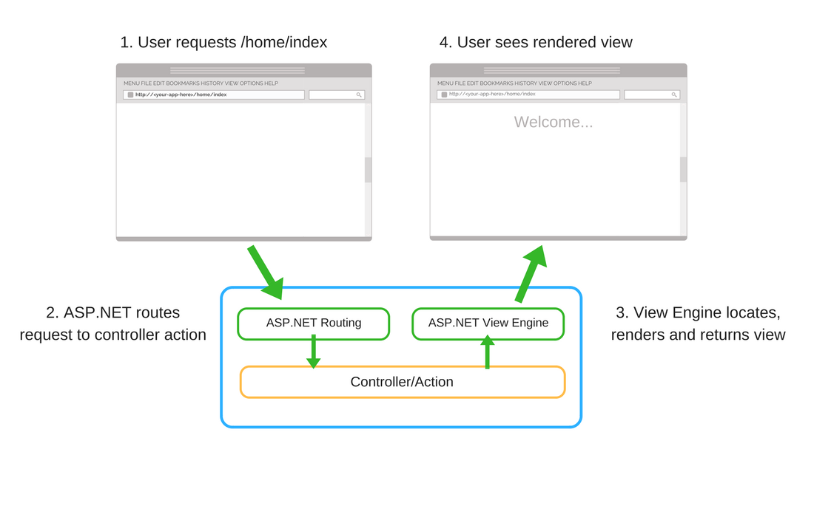
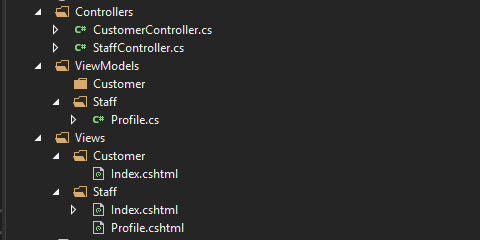
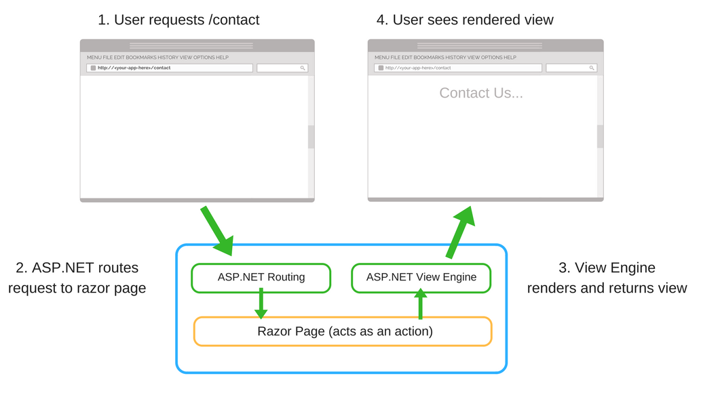
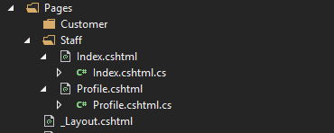

# Razor Pages

Razor Pages is designed to make common patterns used with web browsers easy to implement when building an app. Model binding, Tag Helpers, and HTML helpers work with the properties defined in a Razor Page class.

in start up

AddRazorPages adds services for Razor Pages to the app.

MapRazorPages adds endpoints for Razor Pages to the IEndpointRouteBuilder.

The associations of URL paths to pages are determined by the page's location in the file system.


| File name and path | matching URL |
| ----------- | ----------- |
|  Pages/Index.cshtml      | / or /Index       |
| /Pages/Contact.cshtml   | /Contact        |
| /Pages/Store/Contact.cshtml | /Store/Contact|
| /Pages/Store/Index.cshtml |/Store or /Store/Index|

The PageModel class allows separation of the logic of a page from its presentation. It defines page handlers for requests sent to the page and the data used to render the page.

separation allows

Managing of page dependencies through dependency injection.

Unit testing

The page has an OnPostAsync handler method, which runs on POST requests (when a user posts the form). 

1- OnGet to initialize state needed for the page. In the preceding code, the OnGet method displays the CreateModel.cshtml Razor Page.

2- OnPost to handle form submissions.


flow of OnPostAsync

Check for validation errors.

* If there are no errors, save the data and redirect.

* If there are errors, show the page again with validation messages. In many cases, validation errors would be detected on the client, and never submitted to the server.

[BindProperty] attribute to opt in to model binding, should not be used on models containing properties that should not be changed by the client. 

```
<a asp-page="./Edit" asp-route-id="@contact.Id">Edit</a> 
```
The <a /a> Anchor Tag Helper used the asp-route-{value} attribute to generate a link to the Edit page. The link contains route data with the contact ID.

The validation attributes specify behavior to enforce on the model properties they're applied to

1- The Required and MinimumLength attributes indicate that a property must have a value, but nothing prevents a user from entering white space to satisfy this validation.

2- The RegularExpression attribute is used to limit what characters can be input.

Must only use letters.

The first letter is required to be uppercase. White space, numbers, and special characters are not allowed.

3- The RegularExpression Rating

Requires that the first character be an uppercase letter.

Allows special characters and numbers in subsequent spaces. "PG-13" is valid for a rating, but fails for a "Genre".

4- The Range attribute constrains a value to within a specified range.

5- The StringLength attribute sets the maximum length of a string property, and optionally its minimum length.

6- Value types (such as decimal, int, float, DateTime) are inherently required and don't need the [Required] attribute.

CSS isolation

 reduce or avoid

1- Dependencies on global styles that can be challenging to maintain.

2- Style conflicts in nested content.


{APP ASSEMBLY}.styles.css. The placeholder {APP ASSEMBLY} is the assembly name of the project. A link to the bundled CSS styles is placed in the app's layout.

```
<link rel="stylesheet" href="~/{APP ASSEMBLY}.styles.css" />
```


Razor class library (RCL) support

When a Razor class library (RCL) provides isolated styles, the \<link> tag's href attribute points to {STATIC WEB ASSET BASE PATH}/{PACKAGE ID}.bundle.scp.css, where the placeholders are

{STATIC WEB ASSET BASE PATH}: The static web asset base path.

{PACKAGE ID}: The library's package identifier. The package identifier defaults to the project's assembly name if the package identifier isn't specified in the project file.

Application structure is similar to MVC but there are no folders for controllers and views. The folder called Pages contains all Razor views that in this context are called “pages”. 


Pages are always marked with @page directive that tells view engine this is Razor page and not a regular MVC view.

```
@page
@model AboutModel
@{
    ViewData["Title"] = "About";
}
<h2>@ViewData["Title"].</h2>
<h3>@Model.Message</h3>
 
<p>Use this area to provide additional information.</p>
```

model is more like mix of controller and model.

```
public class AboutModel : PageModel
{
    public string Message { get; set; }
 
    public void OnGet()
    {
        Message = "Your application description page.";
    }
}
```

OnGet() is handler method that is called with GET-request.

OnPost() is handler method that is called with POST-request.

have also asynchronous counterparts supported (OnGetAsync() and OnPostAsync()).


### Pages folder

Contains Razor pages and supporting files. Each Razor page is a pair of files

A .cshtml file that has HTML markup with C# code using Razor syntax.

A .cshtml.cs file that has C# code that handles page events.

wwwroot folder

Contains static assets, like HTML files, JavaScript files, and CSS files.

appsettings.json

Contains configuration data, like connection strings. 

### MVC vs Razor Pages

#### MVC Request



### Folder structure



#### Razor Pages Request



### Folder structure


