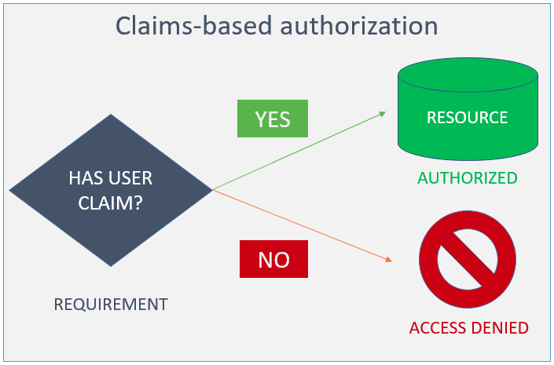
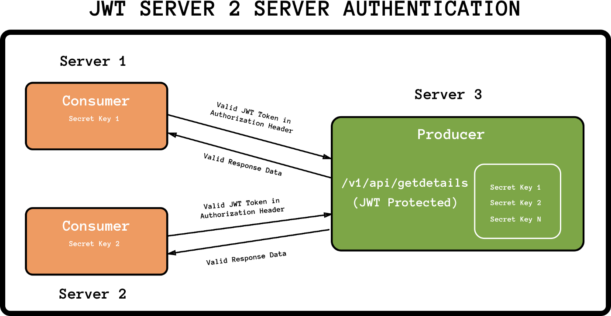

# Claims-based authorization

A Claim is a piece of information about the user. It is consists of a Claim type and an optional value. We store it in the form of name-value pair. A Claim can be anything for example Name Claim, Email  Claim, Role Claim, PhoneNumber Claim, etc.

### Adding claims checks

Claim based authorization checks:

* Are declarative.

* Are applied to Razor Pages, controllers, or actions within a controller.

* Can not be applied at the Razor Page handler level, they must be applied to the Page.

### Storing Claims

A User can have any number of claims. The Identity API stores the claims in the AspNetUserClaims table.



### Authentication with ASP.NET Core

#### The difference between Authentication and Authorisation

* Authentication is the process of determining who you are

* Authorisation revolves around what you are allowed to do

```
public class ClaimsIdentity: IIdentity
{
    public string AuthenticationType { get; }
    public bool IsAuthenticated { get; }
    public IEnumerable\<Claim> Claims { get; }

    public Claim FindFirst(string type) { /*...*/ }
    public Claim HasClaim(string type, string value) { /*...*/ }
}
```

### JWT to authenticate Servers API’s

What is JWT?

JSON Web Token (JWT) is a means of representing claims to be transferred between two parties. The claims in a JWT are encoded as a JSON object that is digitally signed using JSON Web Signature (JWS) and/or encrypted using JSON Web Encryption (JWE).

way of encoding JSON object and use that encoded object as access tokens for authentication from the server.


Following are some standard claims: 

1- Issuer (iss) - identifies principal that issued the JWT;

2- Subject (sub) - identifies the subject of the JWT;

3- Audience (aud) - The "aud" (audience) claim identifies the recipients that the JWT is intended for. Each principal intended to process the JWT must identify itself with a value in the audience claim. If the principal processing the claim does not identify itself with a value in the aud claim when this claim is present, then the JWT must be rejected.

4- Expiration time (exp) - The "exp" (expiration time) claim identifies the expiration time on or after which the JWT must not be accepted for processing. The value should be in NumericDate[10][11] format.

5- Not before (nbf) - Similarly, the not-before time claim identifies the time on which the JWT will start to be accepted for processing.

6- Issued at (iat) - The "iat" (issued at) claim identifies the time at which the JWT was issued.

7- JWT ID (jti) - case sensitive unique identifier of the token even among different issuers.

### Producer and Consumer concept of API’s 

Producer is the one who gives a service. It will be the provider(Server) of the API(s) which are JWT protected.

Consumer is the one who uses it. It will be the customer(Server/Mobile App/ Web App/ Client) who will be providing the valid JWT token to consume the API(s) being provided by the Producer.



#### custom contract

1. Share the SECRET: This is the responsibility of the Producer side to share the mutual secret. This secret will be required to verify the token at the Producer end and the same secret will be used to create the token at the respective consumer side.

2. Prepare the PAYLOAD: Consumer should encode all the data (body or query or params) in the payload of the JWT token (you can choose specific fields that need to be present in the payload of JWT but I would suggest to wrap all the data). We will exact this at producer end to verify that the data is the same in the token payload and the request API.

3. GET the TOKEN: The token should be present in the header with name jwt-token (you can choose your custom name or send it in authorization header after all it’s custom contract)

4. Idenitify the CONSUMER: We just need one last thing and that is to identify our consumer. This we can do it in either way by setting iss: CONSUMER_NAME standard claim in the payload or by sending another header jwt-consumer: CONSUMER_NAME. We will be using the latter one.
