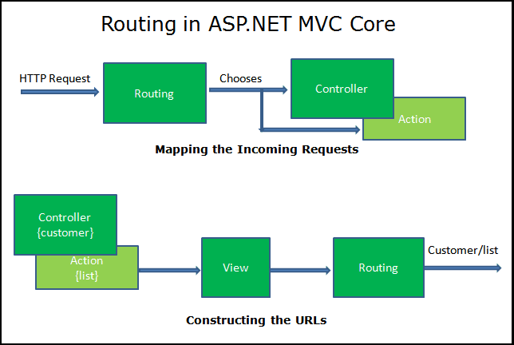

# Routing and Navigation Properties

ASP.NET Routing module is responsible for mapping incoming browser requests to particular MVC controller actions. 

The Default route maps the first segment of a URL to a controller name, the second segment of a URL to a controller action, and the third segment to a parameter named id.

# Routing in ASP.NET Core

Routing is responsible for matching incoming HTTP requests and dispatching those requests to the app's executable endpoints.

### Apps can configure routing using:

1- Controllers

2- Razor Pages

3- SignalR

4- gRPC Services

5- Endpoint-enabled middleware such as Health Checks.

6- Delegates and lambdas registered with routing.

### Routing uses a pair of middleware, registered by UseRouting and UseEndpoints:

1 UseRouting adds route matching to the middleware pipeline. This middleware looks at the set of endpoints defined in the app, and selects the best match based on the request.

2- UseEndpoints adds endpoint execution to the middleware pipeline. It runs the delegate associated with the selected endpoint.

### URL matching

1- Is the process by which routing matches an incoming request to an endpoint.

2- Is based on data in the URL path and headers.

3- Can be extended to consider any data in the request.

