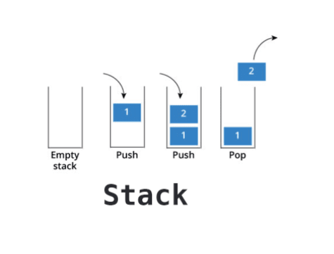
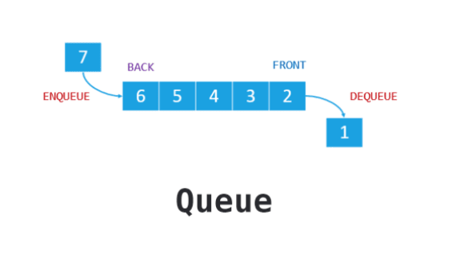

# Stacks and Queues

## Stack

## A stack is a data structure that consists of Nodes. Each Node references the next Node in the stack, but does not reference its previous.

stack follow FILO concept 

* Push - Nodes or items that are put into the stack are pushed O(1)

* Pop - Nodes or items that are removed from the stack are popped. When you attempt to pop an empty stack an exception will be raised  O(1).

* Top - This is the top of the stack.

* Peek - When you peek you will view the value of the top Node in the stack. When you attempt to peek an empty stack an exception will be raised O(1).

* IsEmpty - returns true when stack is empty otherwise returns false.  

#### topmost item is denoted as the top

## Queue

## A queue is a linear structure which follows a particular order in which the operations are performed.

* Enqueue - Nodes or items that are added to the queue O(1).

* Dequeue - Nodes or items that are removed from the queue. If called when the queue is empty an exception will be raised O(1).

* Front - This is the front/first Node of the queue.

* Rear - This is the rear/last Node of the queue.

* Peek - When you peek you will view the value of the front Node in the queue. If called when the queue is empty an exception will be raised O(1).

* IsEmpty - returns true when queue is empty otherwise returns false O(1).
