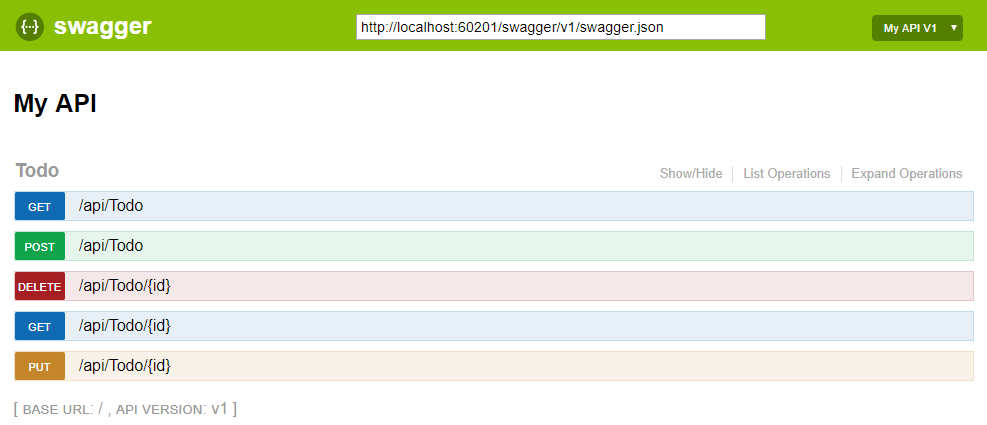

# Swagger 

(OpenAPI) is a language-agnostic specification for describing REST APIs. It allows both computers and humans to understand the capabilities of a REST API without direct access to the source code.

### Goals:

1- Minimize the amount of work needed to connect decoupled services.

2- Reduce the amount of time needed to accurately document a service.

### OpenApi vs. Swagger

1- OpenAPI is a specification.

2- Swagger is tooling that uses the OpenAPI specification. For example, OpenAPIGenerator and SwaggerUI.

### OpenAPI specification

is a document that describes the capabilities of your API.

### Swagger UI 

offers a web-based UI that provides information about the service, using the generated OpenAPI specification. 

### Unit Tests for ASP.NET MVC Applications

demonstrate how to  write unit tests for the controllers in ASP.NET MVC applications. 

### Goals of Unit Testing

take the smallest piece of testable software in the application and determine whether it behaves exactly as you expect.Each unit is tested separately before integrating them into modules to test the interfaces between modules.

resource: https://www.tutorialspoint.com/asp.net_mvc/asp.net_mvc_unit_testing.htm

### Unit test controller

#### Controllers

play a central role in any ASP.NET Core MVC app. As such, you should have confidence that controllers behave as intended. Automated tests can detect errors before the app is deployed to a production environment. It’s important to avoid placing unnecessary responsibilities within your controllers and ensure your tests focus only on controller responsibilities.

#### Unit tests

involve testing a part of an app in isolation from its infrastructure and dependencies. When unit testing controller logic, only the contents of a single action are tested, not the behavior of its dependencies or of the framework itself.. A controller unit test avoids things like filters, routing, or model binding. By focusing on testing just one thing, unit tests are generally simple to write and quick to run. A well-written set of unit tests can be run frequently without much overhead. 

