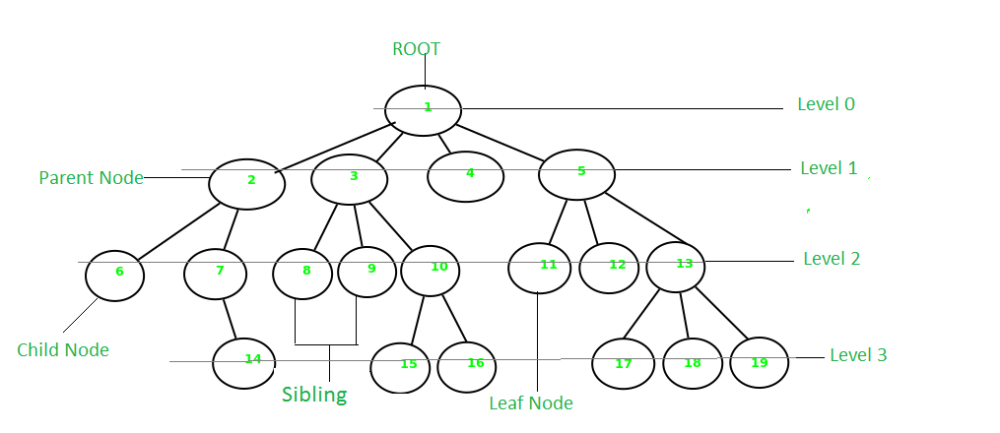

# Trees :A tree is non-linear and a hierarchical data structure consisting of a collection of nodes such that each node of the tree stores a value, a list of references to nodes (the “children”)

1- Node - A Tree node is a component which may contain its own values, and references to other nodes

2- Root - The root is the node at the beginning of the tree

3- K - A number that specifies the maximum number of children any node may have in a k-ary tree. In a binary tree, k = 2.

4- Left - A reference to one child node, in a binary tree

5- Right - A reference to the other child node, in a binary tree

6- Edge - The edge in a tree is the link between a parent and child node

7- Leaf - A leaf is a node that does not have any children

8- Height - The height of a tree is the number of edges from the root to the furthest leaf

#Traversals

### Depth First: is a method for exploring a tree or graph. In a DFS, you go as deep as possible down one path before backing up and trying a different one

#### use the call stack via recursion

#### methods for depth first traversal:

1- Pre-order: root >> left >> right

2- In-order: left >> root >> right

3- Post-order: left >> right >> root

The biggest difference between each of the traversals is when you are looking at the root node.

### Breadth First: iterates through the tree by going through each level of the tree node-by-node.

#### uses a queue

### Binary Tree Vs K-ary Trees

K-ary Trees: Nodes are able have more than 2 child nodes

K to refer to the maximum number of children that each Node is able to have.
