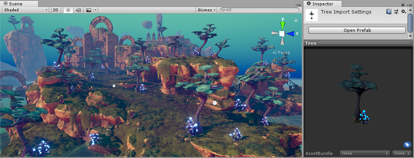
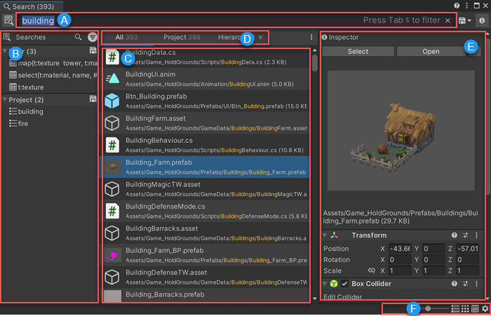
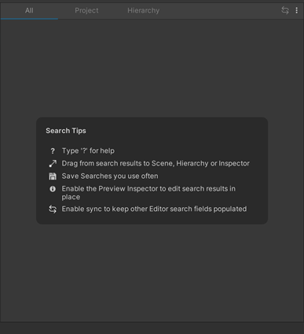
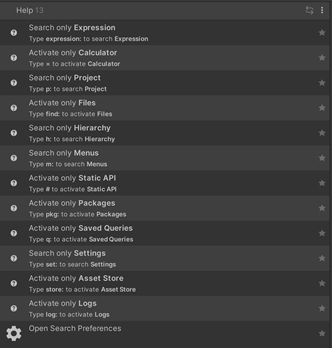

# Unity

Documentation versions
The Unity documentation is the Unity User Manual and Unity Scripting API Reference.

As we continually improve Unity (that is; the Editor and the engine), we add new features, improve existing features, and sometimes remove old features.

With each Unity release, the Unity documentation changes to reflect this, so make sure you use the correct version of the User Manual and Scripting API Reference to match the version of Unity you’re using.

The version of the documentation which accompanies the current full release of Unity is always available online at docs.unity3d.com.

Packages and feature sets
A package contains features to fit the various needs of your project. This can include any core features of Unity that are installed along with the Editor, or other packages that you can install as needed.

For more information about using packages in general, see Working with the Package Manager.

Feature sets are bundles of related packages that you can either use to accomplish a specific objective, such as building environments or optimizing specific platforms, or to find all the development tools you need in one place.

If you are only interested in finding documentation or information about a specific package, click the links on the Released packages, Pre-release packages, Core packages and Built-in packages
 pages. To find a package by keyword, see the Packages by keywords page.

Released packages

“Released” packages are packages that have undergone testing with a specific version of Unity, and all other packages released for that version. The package also contains complete and accurate documentation, an updated changelog, and valid licensing.

2D Animation provides all the necessary tooling and runtime components for skeletal animation using Sprites.

The 2D Pixel Perfect package contains the Pixel Perfect Camera component which ensures your pixel art remains crisp and clear at different resolutions, and stable in motion.

A ScriptedImporter for importing Adobe Photoshop PSB (Photoshop Big) file format. The ScriptedImporter is currently targeted for users who wants to create multi Sprite character animation using Unity 2D Animation Package.

SpriteShape Runtime & Editor Package contains the tooling and the runtime component that allows you to create very organic looking spline based 2D worlds. It comes with intuitive configurator and a highly performant renderer.

2D Tilemap Extras is a package that contains extra scripts for use with 2D Tilemap features in Unity. These include custom Tiles and Brushes for the Tilemap feature.

The Adaptive Performance package provides an API to get feedback about the thermal and power state of mobile devices, enabling applications to make performance-relevant adaptions at runtime.

The Addressable Asset System allows the developer to ask for an asset via its address. Once an asset (e.g. a prefab) is marked "addressable", it generates an address which can be called from anywhere. Wherever the asset resides (local or remote), the system will locate it and its dependencies, then return it.

The Addressable Asset System allows the developer to ask for an asset via its address. Once an asset (e.g. a prefab) is marked "addressable", it generates an address which can be called from anywhere. Wherever the asset resides (local or remote), the system will locate it and its dependencies, then return it.

2D game development quickstart guide
This quickstart guide is for 2D game developers who want to create a 2D game in Unity. You can create several different types of 2D games with Unity. You can read this guide from end to end, but note that some sections are more relevant for 2D games with certain game perspectives and art styles.

Note: This guide applies to all versions of Unity from 2019 LTS upwards.

This quickstart guide helps you

Decide what game perspective or viewpoint you want your game to have.
Decide what art style you want your game to have.
Set up your Unity project.
Create a 2D game.

Unity helps you simulate physics in your Project to ensure that the objects correctly accelerate and respond to collisions
, gravity, and various other forces. Unity provides different physics engine implementations which you can use according to your Project needs: 3D, 2D, object-oriented, or data-oriented. This page provides the links to their documentation.

# Unity Search

Use Search to search sources inside of Unity and perform actions on the results.

For example, from the Search window you can find Assets and open them, find Unity packages and install them, or find menu commands and run them.

The Search window
To launch Search use the Ctrl + K shortcut, click the magnifying glass icon in the top right of the Editor window, or use the menu (Edit > Search All).

Note: You can customize the shortcut for Search in the Shortcuts Manager.

A	Search field	Enter your search query here.
For details about all the ways you can search Unity with Search, see Using Search.

B	Saved Searches	Access your saved searches. To show/hide the pane, click the Saved Searches icon () or select Searches from the More Options (:) menu.
To save your search query, use the Save icon to the right of the Search field.

C	Search Provider	Allows you to see all results from standard Search Providers (Project, Hierarchy, Settings) or from other Search Providers by using a specific search token. Select More Options (:) to access a list Search Providers.

D	Results area	Displays search results as you type the search query.
Items that best match the search query appear higher in the results. Search also learns over time, and prioritizes items that you select often. See Search Preferences to learn how to customize search result ordering.

E	Preview Inspector
Allows you to view and change item properties, open, reimport or delete a search item, or copy a path. To show/hide the pane, click the Inspector icon () or select Inspector from the More Options (:) menu.

F	Views and Preferences	Change Search views and open the Preferences window.
Unity Search Help

You can get help with Search in the following ways

When you first launch the Search window, the results area displays the basic keyboard shortcuts.

Type ? (question mark) in the search field to display a quick reference for different types of searches. See Getting Search help for more information.

Select the question mark icon at the top of the window to open the Search documentation.

