# **Select**
### used to retrieve data from a SQL database
#### Select query for a specific columns
SELECT column, another_column, …
FROM mytable;

#### Select query for all columns
SELECT * 
FROM mytable;

# **Queries with constraints** 
### Where Clause: filter certain results from being returned

#### Select query with constraints
SELECT column, another_column, …
FROM mytable
WHERE condition
    AND/OR another_condition
    AND/OR …;

#### complex clauses can be constructed by below operators:
= , != or <> , < , <= , > , >= , BETWEEN … AND … , NOT BETWEEN … AND …	, IN (…) , NOT IN (…) , LIKE , NOT LIKE , % , _

# **Filtering and sorting Query results**
### DISTINCT: discard rows that have a duplicate column value
Select query with unique results
SELECT DISTINCT column, another_column, …
FROM mytable
WHERE condition(s);

### ORDER BY: a way to sort your results by a given column in ascending or descending order
Select query with ordered results
SELECT column, another_column, …
FROM mytable
WHERE condition(s)
ORDER BY column ASC/DESC;

### Limiting results to a subset: LIMIT will reduce the number of rows to return, and the optional OFFSET will specify where to begin counting the number rows from.
##### Select query with limited rows:
SELECT column, another_column, …
FROM mytable
WHERE condition(s)
ORDER BY column ASC/DESC
LIMIT num_limit OFFSET num_offset;

# **Multi-table queries with JOIN**
### Join: we can combine row data across two separate tables using this unique key.
##### Select query with INNER JOIN on multiple tables
SELECT column, another_table_column, …
FROM mytable
INNER JOIN another_table 
    ON mytable.id = another_table.id
WHERE condition(s)
ORDER BY column, … ASC/DESC
LIMIT num_limit OFFSET num_offset;

##### INNER JOIN: is a process that matches rows from the first table and the second table which have the same key (as defined by the ON constraint) to create a result row with the combined columns from both tables.

#  **Inserting rows**
### INSERT:  declares which table to write into, the columns of data that we are filling, and one or more rows of data to insert. In general, each row of data you insert should contain values for every corresponding column in the table. You can insert multiple rows at a time by just listing them sequentially.
#### Insert statement with values for all columns
INSERT INTO mytable
VALUES (value_or_expr, another_value_or_expr, …),
       (value_or_expr_2, another_value_or_expr_2, …),
       …;

# **Updating rows**

### UPDATE: is similar to the INSERT statement, you have to specify exactly which table, columns, and rows to update. In addition, the data you are updating has to match the data type of the columns in the table schema.
#### Update statement with values
UPDATE mytable
SET column = value_or_expr, 
    other_column = another_value_or_expr, 
    …
WHERE condition;

# **Deleting rows**
### DELETE : to delete data from a table in the database
##### Delete statement with condition
DELETE FROM mytable
WHERE condition;

# **Creating tables**

### CREATE: When you have new entities and relationships to store in your database, you can create a new database table using the CREATE TABLE statement.

##### Create table statement w/ optional table constraint and default value
CREATE TABLE IF NOT EXISTS mytable (
    column DataType TableConstraint DEFAULT default_value,
    another_column DataType TableConstraint DEFAULT default_value,
    …
);

# **Altering tables**
### Alter:As your data changes over time, SQL provides a way for you to update your corresponding tables and database schemas by using the ALTER TABLE statement to add, remove, or modify columns and table constraints.
##### Altering table to add new column(s)
ALTER TABLE mytable
ADD column DataType OptionalTableConstraint 
    DEFAULT default_value;

### Removing columns:Dropping columns is as easy as specifying the column to drop, however, some databases (including SQLite) don't support this feature. Instead you may have to create a new table and migrate the data over.
#### Altering table to remove column(s)
ALTER TABLE mytable
DROP column_to_be_deleted;

### Renaming the table: If you need to rename the table itself, you can also do that using the RENAME TO clause of the statement.
##### Altering table name
ALTER TABLE mytable
RENAME TO new_table_name;
# **Dropping tables**
##### In some rare cases, you may want to remove an entire table including all of its data and metadata, and to do so, you can use the DROP TABLE statement, which differs from the DELETE statement in that it also removes the table schema from the database entirely.
Drop table statement
DROP TABLE IF EXISTS mytable;
## Photos
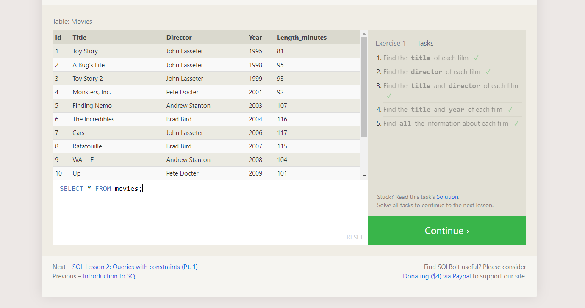
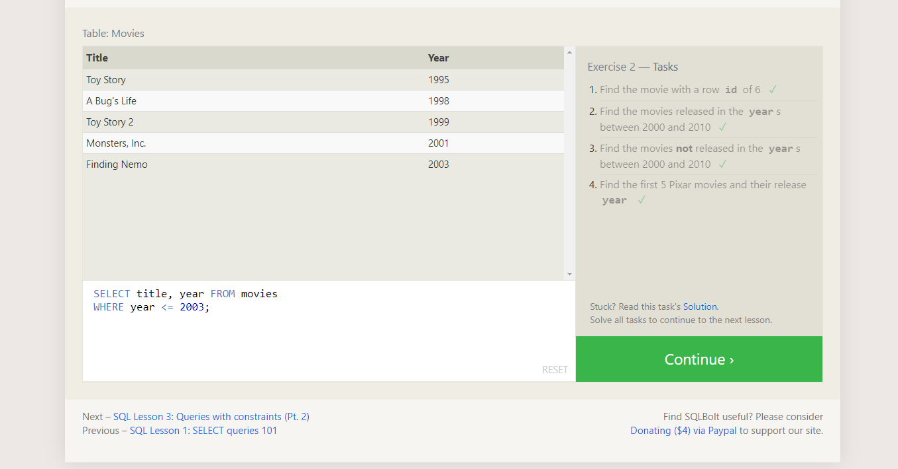
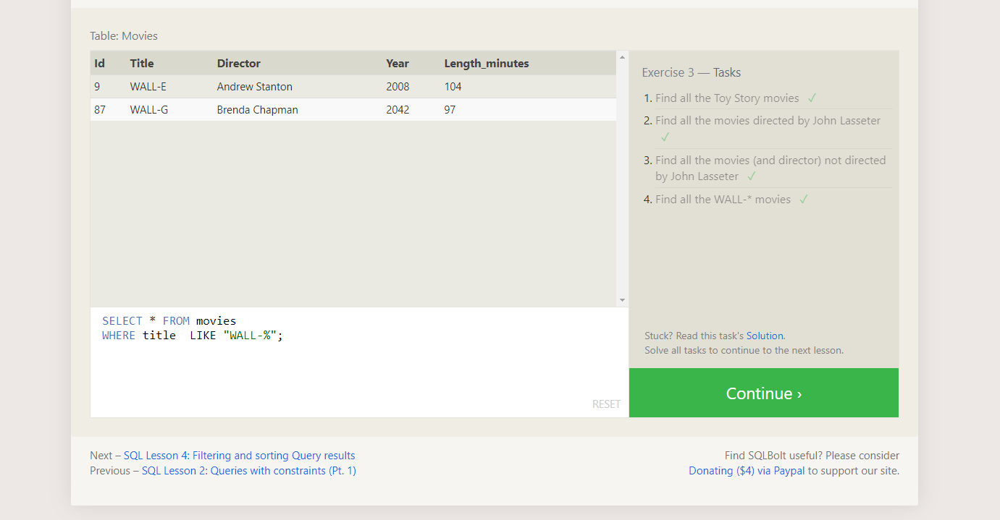

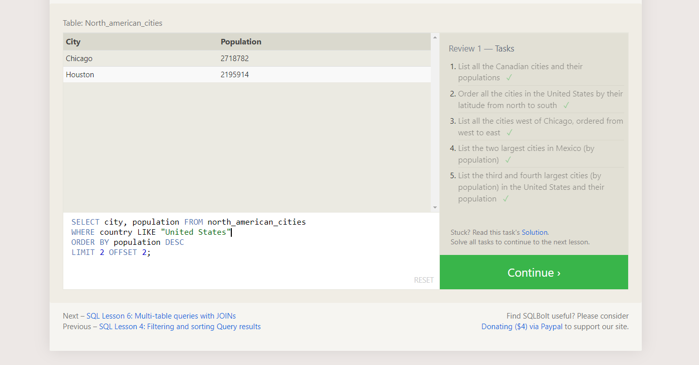
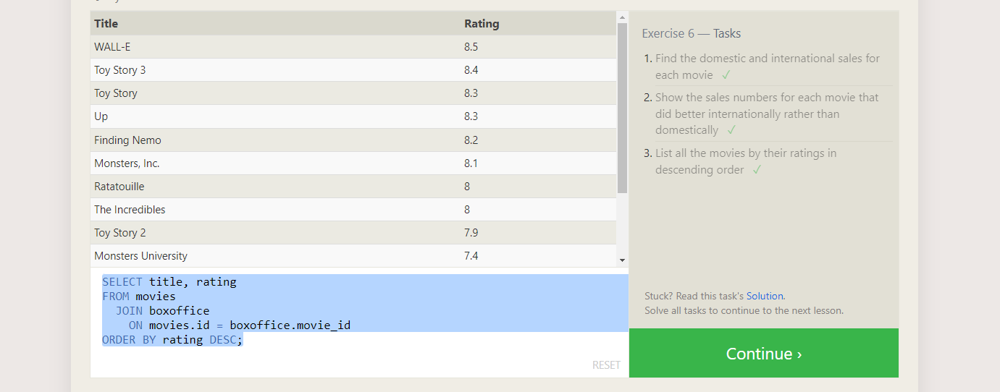
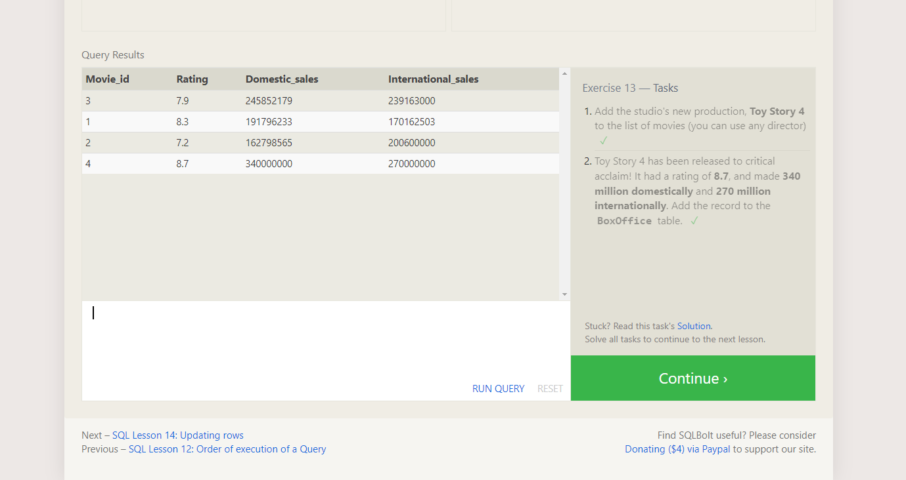
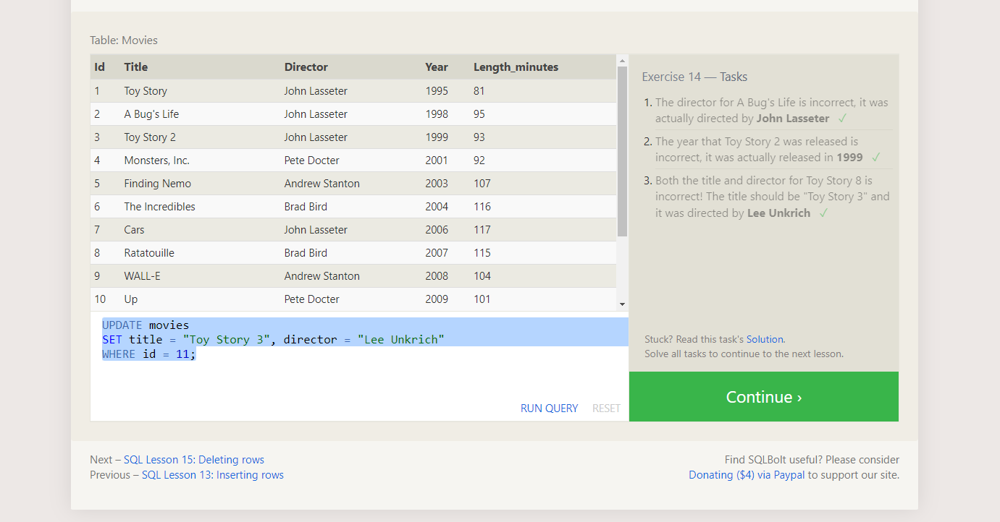
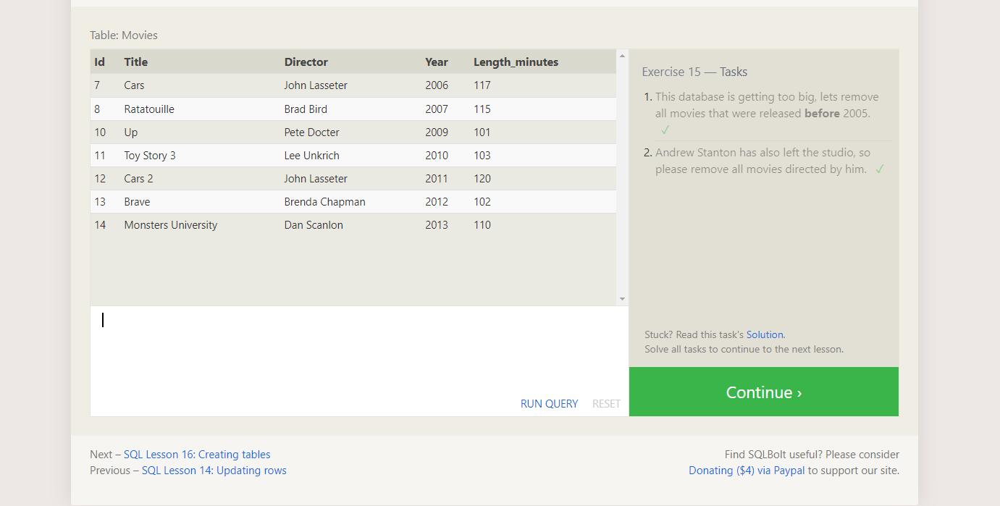
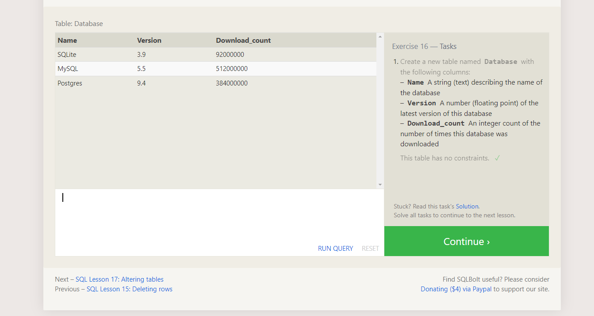
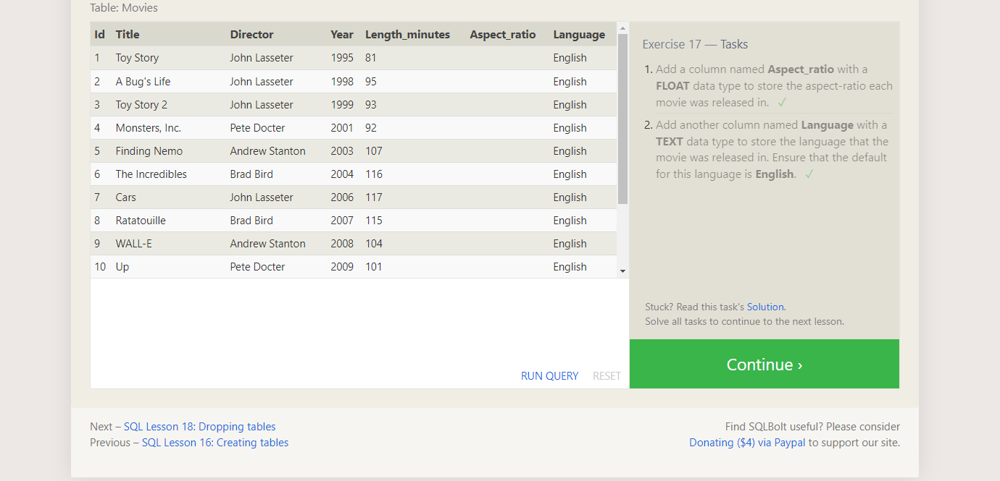
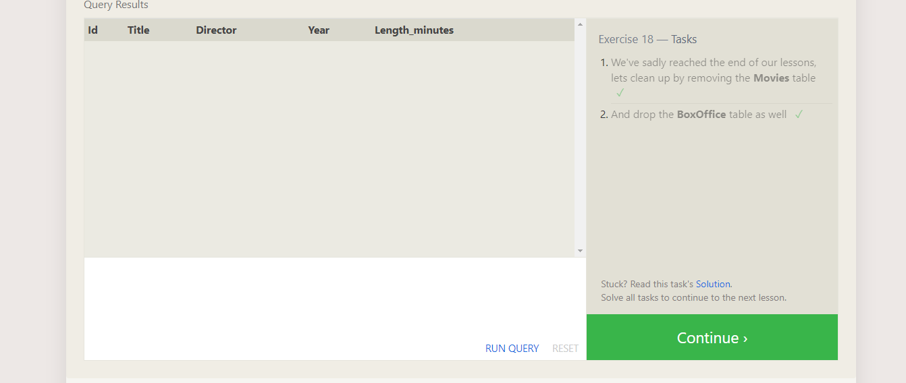

