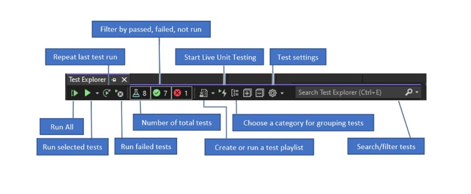

## Unit Testing

* is used to take each unit in my code and test it separetly,to check if code is working as expected
* has the greatest effect on the quality of your code
#### Visual Studio Enterprise can do this automatically with Live Unit Testing, which detects tests affected by your code changes and runs them in the background as you type.
#### from : https://docs.microsoft.com/en-us/visualstudio/test/unit-test-basics?view=vs-2022
#### Generate unit test project and unit test stubs
* From the code editor window, right-click and choose Create Unit Tests from the right-click menu.

* Click OK to accept the defaults to create your unit tests, or change the values used to create and name the unit test project and the unit tests. You can select the code that is added by default to the unit test methods.

* The unit test stubs are created in a new unit test project for all the methods in the class.

#### The AAA (Arrange, Act, Assert) pattern is a common way of writing unit tests for a method under test.

* The Arrange section of a unit test method initializes objects and sets the value of the data that is passed to the method under test.

* The Act section invokes the method under test with the arranged parameters.

* The Assert section verifies that the action of the method under test behaves as expected. For .NET, methods in the Assert class are often used for verification.

### Run tests in Test Explorer
#### When you build the test project, the tests appear in Test Explorer. If Test Explorer is not visible, choose Test on the Visual Studio menu, choose Windows, and then choose Test Explorer (or press Ctrl + E, T).

### Run and view tests
#### Test Explorer Toolbar

#### Run tests after every build
To run your unit tests after each local build, open the settings icon in the Test Explorer toolbar and select Run Tests After Build.